# 交作业操作

## 先进入组织

登录自己的账号。根据组织的邀请链接同意进入组织。

邀请链接：https://gitee.com/organizations/cq-html5-2304/invite?invite=75b117bb64ee9b51cc7e43424639fadab7a33ac9c09fd4ee89af7052ef9d09fbbfc75370d6c6f0e9e766b0d826817bc9

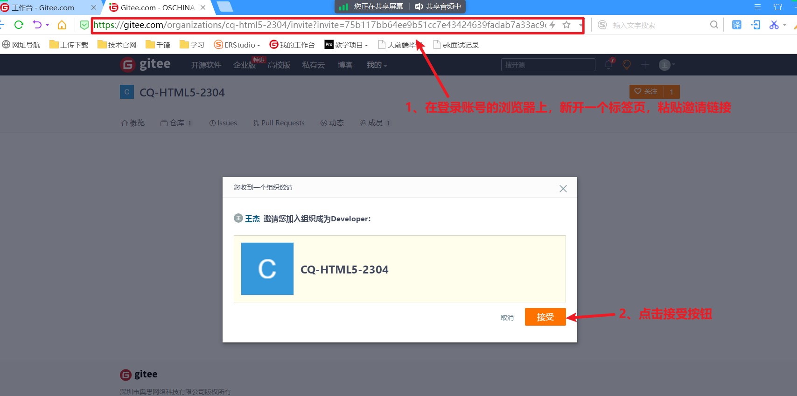 

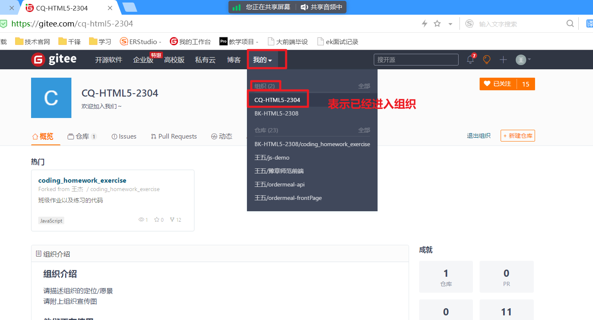 

## 进入仓库

根据组织中的邀请，进入仓库

当管理员发起仓库邀请后，我们找到邀请，进入仓库。

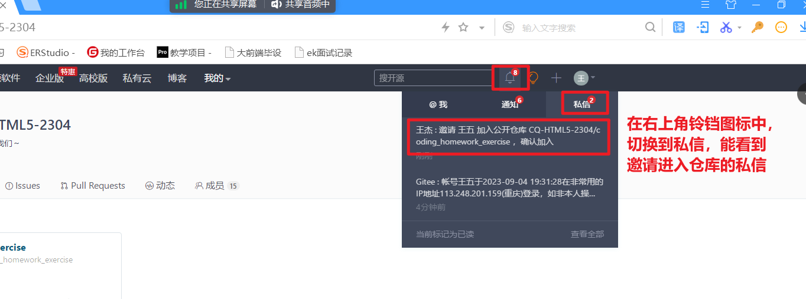 

点击这封私信，进入私信页面

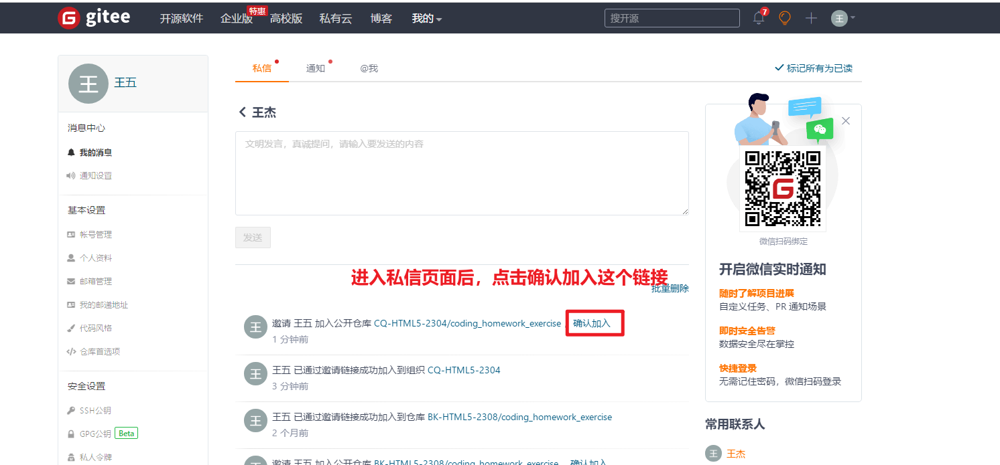 

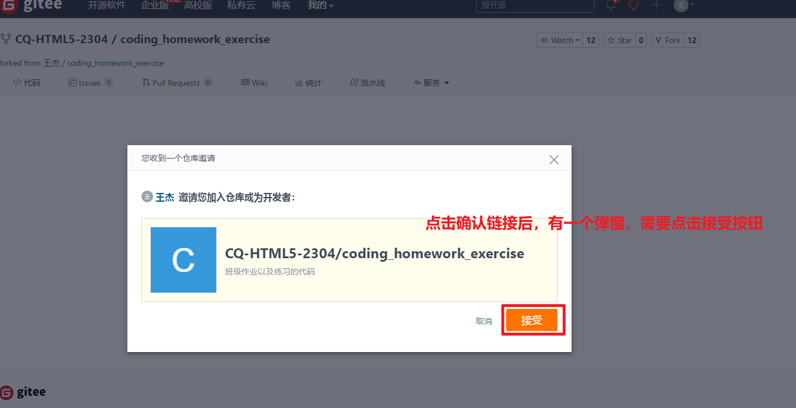 

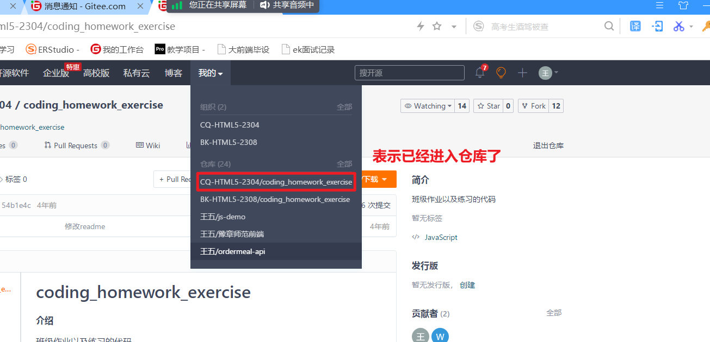 

## 提交作业到仓库

安装一个软件：git

双击下一步下一步傻瓜式安装，尽量装在c盘。

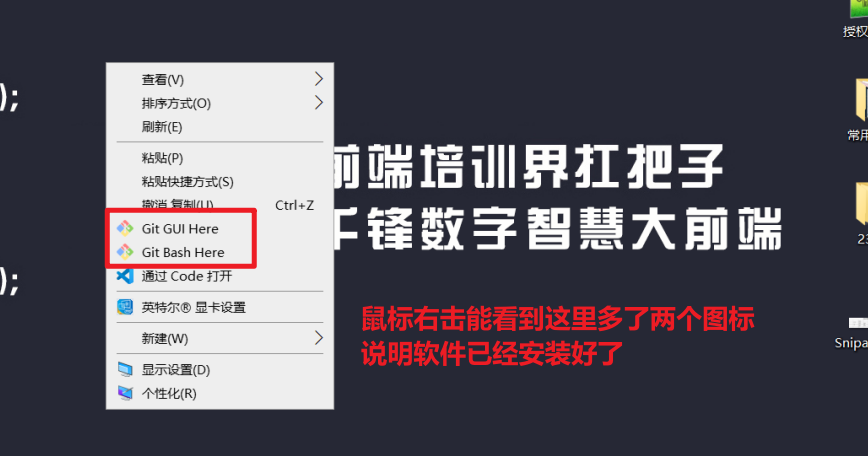 

我们在空闲空间较大的磁盘中，新建一个文件夹，准备用于存放所有的作业。

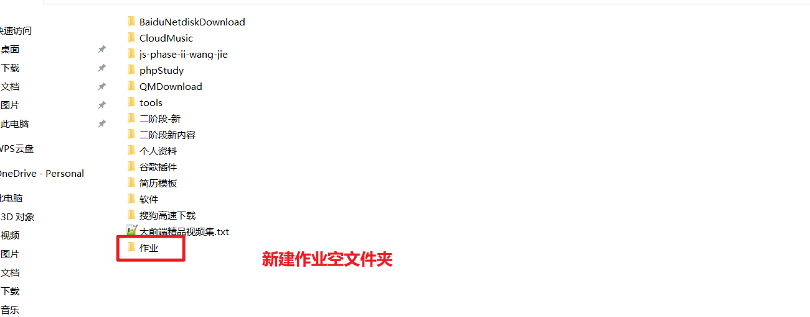 

进入这个文件夹，鼠标右击，选择"Git Base Here"，然后会打开一个命令窗口。

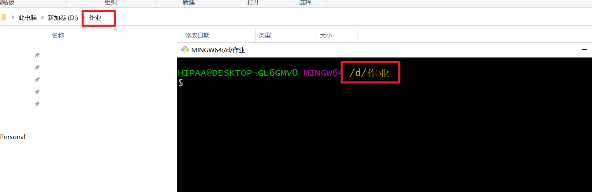 

输入命令，敲回车。

```shell
git clone 仓库地址
```

仓库地址，需要进入仓库去复制地址：

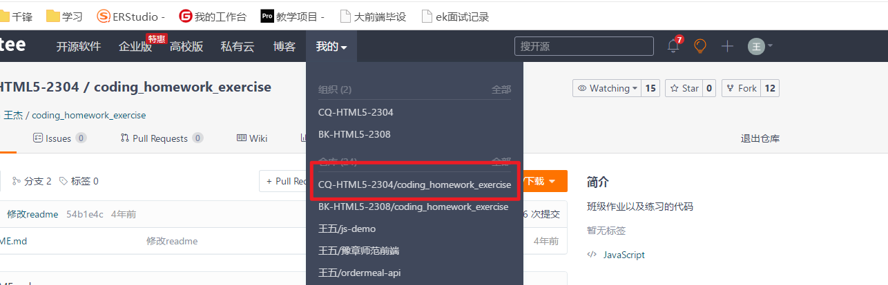 

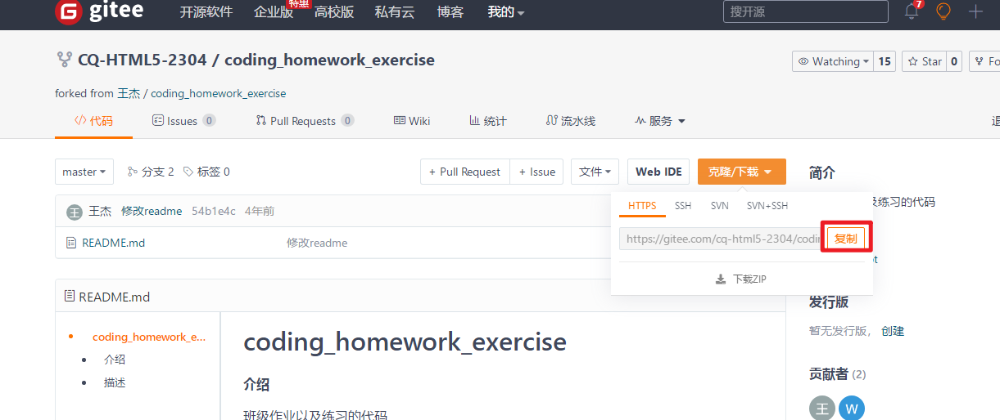 

例如：

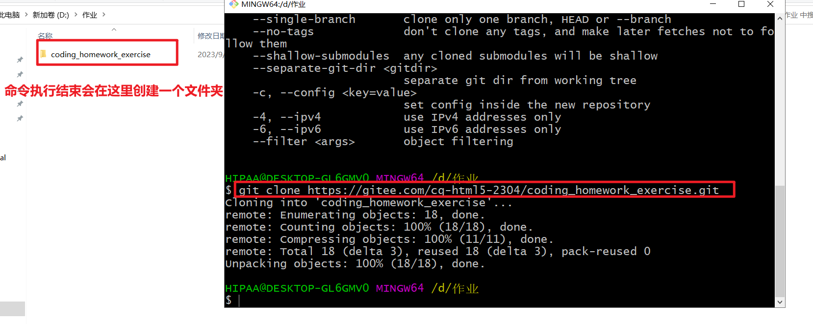 

进入文件夹：

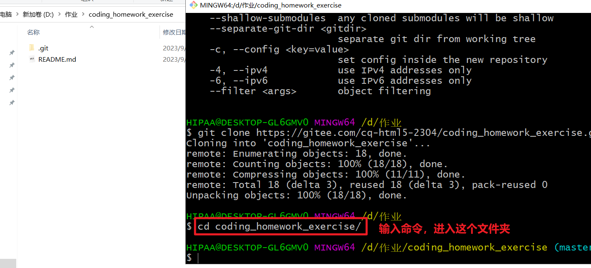 

创建属于自己的分支：

```shell
git checkout -b 自己的真实姓名
```

例如：

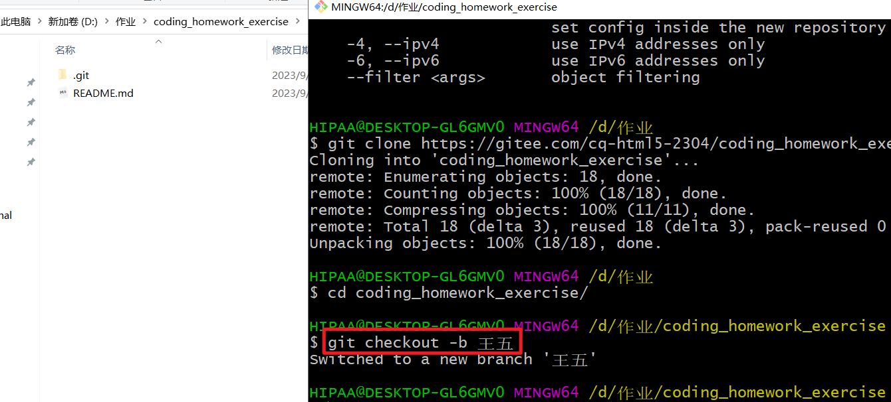 

在文件夹下新建文件夹，在文件夹中存放作业文件：

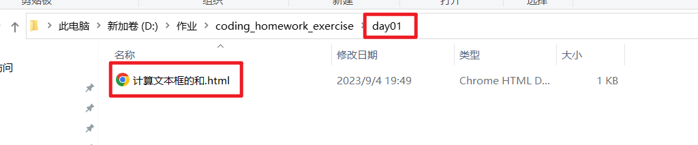 

上交：

执行命令：

第一个命令

```shell
git add .
```

第二个命令：

```shell
git commit -m "自己的描述"
```

第三个命令：

```shell
git push -u origin 自己的真实姓名 
```

接下来会弹出一个窗口要求我们输入账号和密码：

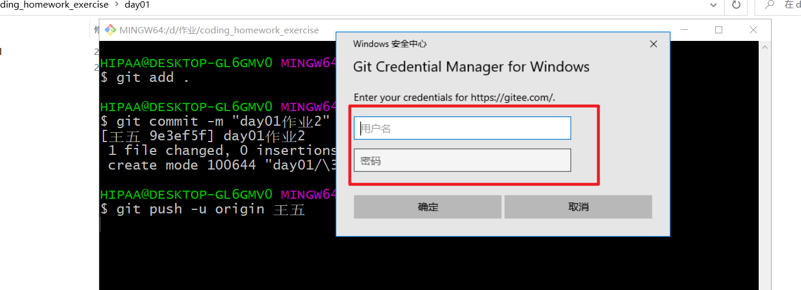 

这里的密码就输入我们注册账号时的密码；

账号我们使用账号提供的邮箱：

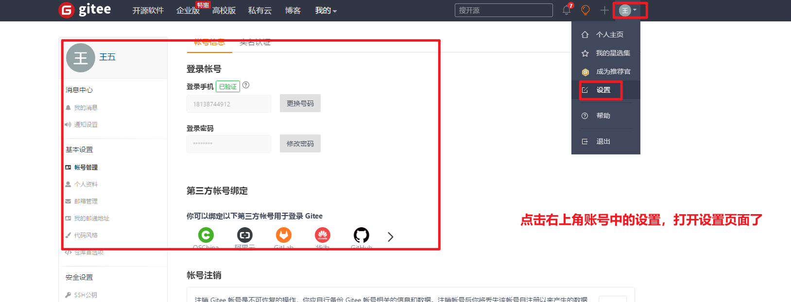 

点击左侧的邮箱管理，打开邮箱管理的页面：

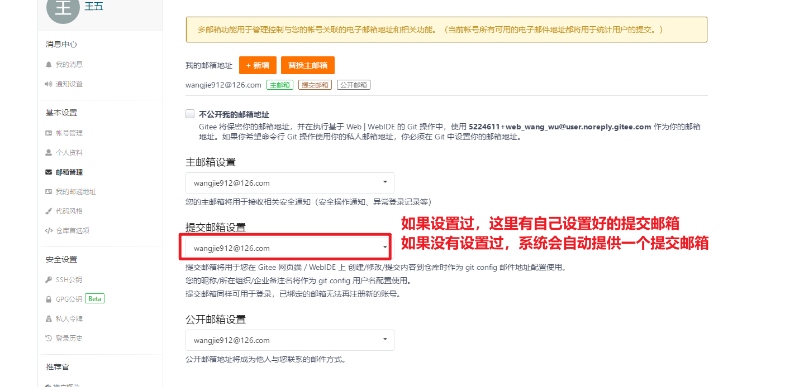 

要输入的账号，就使用这里的提交邮箱。

例如：

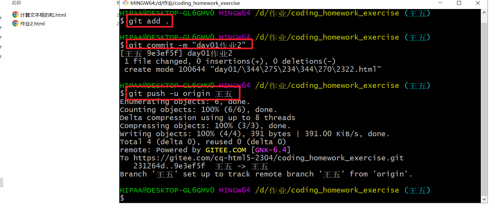 

这样就将作业提交上去了。

如果提示让我们输入邮箱和姓名，我们就执行两个命令：

```shell
git config --global user.email '邮箱号'
git config --global user.name '名字'
```

如果非第一次提交：

将作业文件放好。

在 coding_homework_exercise文件夹下，鼠标右击，选择"Git Bash Here"，打开命令窗口。

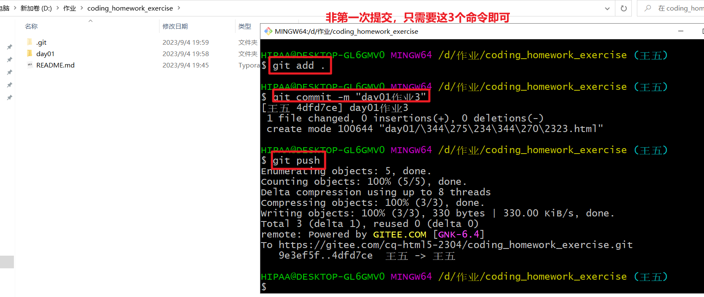 